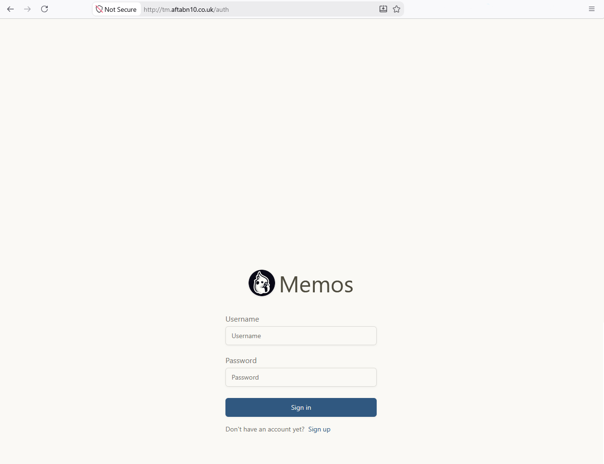
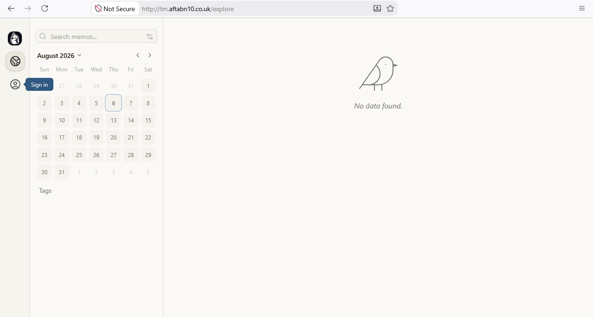
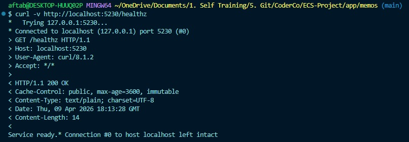
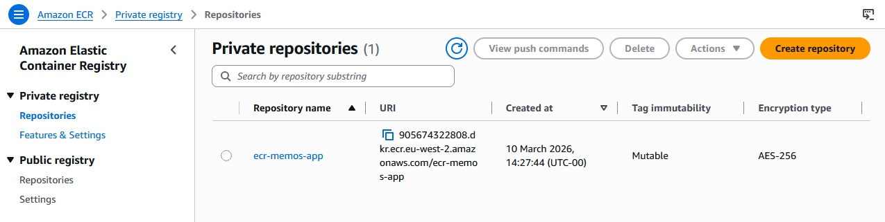

# Memos on AWS ECS Deployment

## Overview

This project demonstrates the deployment of the open-source **Memos** application to AWS using Docker, Amazon ECS/Fargate and Terraform.

The project follows the progression recommended for the ECS project:

**ClickOps → Terraform → CI/CD**

The infrastructure was initially created manually using the AWS Console to understand how the individual AWS services interact. The infrastructure was then destroyed and recreated using Terraform as Infrastructure as Code (IaC).

The final deployment uses:

- Docker for application containerisation
- Amazon ECR for container image storage
- Amazon ECS/Fargate for running the application
- Application Load Balancer (ALB) for traffic distribution
- AWS Certificate Manager (ACM) for HTTPS
- Route 53 for DNS
- Terraform for infrastructure provisioning
- Amazon S3 for Terraform remote state
- DynamoDB for Terraform state locking
- GitHub Actions for CI/CD
- GitHub Actions OIDC for AWS authentication
- Automated post-deployment health checks

### Final Application

The final application is available at:

https://tm.aftabn10.co.uk





# 1. Application Setup

## Application Selection

For this project I selected **Memos**, an open-source self-hosted note-taking application written in Go.

I chose Memos because it provided a realistic, lightweight application that could be containerised and deployed to ECS/Fargate, while allowing the main focus of the project to remain on containerisation, AWS infrastructure and deployment rather than application development.

- **Application:** Memos
- **Language:** Go
- **Application documentation:** [Memos Documentation](https://usememos.com/docs)
- **Source code:** [Memos GitHub Repository](https://github.com/usememos/memos)

## Running Memos Locally

Before introducing Docker or AWS infrastructure, I first verified that the application could run successfully on my local machine.

I navigated to the application directory:

```bash
cd ECS-Project/app/memos
```
The application was started using:
```bash
go run ./cmd/memos/main.go --port 80
```
This allowed the application to be accessed locally at:
```bash
http://localhost:80
```
## Health Endpoint

The project specification requested a /health endpoint returning a successful health response.

However, Memos uses a different health endpoint:
```bash
/healthz
```
After inspecting the application source code, I confirmed that /healthz is the endpoint exposed by the Memos server.

The endpoint was tested using:
```bash
curl http://localhost:80/healthz
```
The application returned:
```bash
Service Ready
```
This confirmed that the application was running successfully and that its health endpoint was accessible before moving on to containerisation.

# 2. Containerisation

The next stage was to containerise the Memos application using Docker.

The Memos application is written in Go, with its dependencies defined in go.mod and go.sum.

The Docker image was designed as a multi-stage build, separating compilation from the runtime environment.

## Dockerfile

The Dockerfile uses two stages:

## Builder stage

The builder stage:

1. Uses a lightweight Go Alpine image as the build environment.
2. Sets the working directory inside the container.
3. Copies go.mod and go.sum before the rest of the source code.
4. Downloads the Go dependencies.
5. Copies the application source code.
6. Compiles the application into a binary.

Copying `go.mod` and `go.sum` before the application source allows Docker to take advantage of layer caching when the application dependencies have not changed.

## Runtime stage

The runtime stage uses a lightweight Alpine image rather than retaining the complete Go build environment.

It:

1. Copies the compiled application binary from the builder stage.
2. Creates a dedicated non-root user and group.
3. Creates the application's data directory.
4. Assigns ownership of the data directory to the non-root user.
5. Switches the container to run as the non-root user.
6. Exposes port `5230`.
7. Starts the compiled Memos application.

Running the application as a non-root user reduces the security risk associated with running the application with root privileges inside the container.

## Application Data

During the initial Docker testing, the application failed to start because Memos expected a data directory to be available.

The initial container run produced:
```bash
ERROR failed to check dsn data="" error="unable to access data folder : stat : no such file or directory"
```
I reviewed the Memos documentation and found that the application uses `/var/opt/memos` for its persistent application data.

A Docker volume was therefore mounted:
```bash
-v ~/.memos:/var/opt/memos
```
This maps the local `~/.memos` directory to `/var/opt/memos` inside the container.

However, simply mounting the volume was not sufficient because the container also needed appropriate permissions to access the directory.

I tested several configurations while troubleshooting this.

## Test 1: Volume without directory preparation
```bash
docker run -d -p 80:8081 \
  -v ~/.memos:/var/opt/memos \
  memos
```
This resulted in:
```bash
unable to access data folder: stat : no such file or directory
```
## Test 2: Environment variable without directory ownership

I also tested configuring the data directory through the environment variable:
```bash
MEMOS_DATA=/var/opt/memos
```
This resulted in a permissions error:
```
mkdir /var/opt/memos: permission denied
```
## Final solution

The final Dockerfile creates the required directory and assigns ownership to the non-root user.

This allowed the application to run successfully while still avoiding the use of the root user.

The container was then started using:
```bash
docker run -d \
  -p 5230:5230 \
  -v ~/.memos:/var/opt/memos \
  memos
```
The running container was verified using:
```bash
docker ps
```
and the application logs were checked using:
```bash
docker logs <container-id>
```
The logs confirmed that the application had started successfully.

## Health Check

The Memos application does not use the `/health` endpoint specified in the original project requirements.

After inspecting the application source code, I established that the health endpoint is:
```bash
/healthz
```
The running container was therefore tested using:
```bash
curl -v http://localhost:5230/healthz
```
The endpoint successfully returned:
```bash
Service Ready
```
This confirmed that the Memos application was running successfully inside the Docker container.



## Docker Image Size

After successfully building the final image, the image size was checked using:
```bash
docker images
```
The resulting image was approximately:
```bash
28.28 MB
```
Using a multi-stage build means the final runtime image does not contain the Go compiler and other build dependencies that were only required during compilation.

This helps keep the final image lightweight.

## Image Tagging

During development the image was built using:
```bash
docker build -t memos .
```
If no explicit version is provided, Docker uses the `latest` tag by default.

For deployments, immutable tags are preferable because they allow a specific version of the application to be identified.

For example:
```bash
docker build -t memos:v1 .
```
In the CI/CD pipeline, the Docker image is instead tagged using the **Git commit SHA**, allowing each deployment to be associated with a specific version of the source code.

# 3. Image Registry: Amazon ECR

Once the Memos application had been successfully containerised, the next step was to store the Docker image in a container registry so that it could later be retrieved by Amazon ECS.

For this project I selected **Amazon Elastic Container Registry (ECR)**, as the final application would be deployed to Amazon ECS/Fargate.

## Creating the ECR Repository

I created an ECR repository called:

`ecr-memos-app`

The repository was configured with:

- Mutable image tags
- AES-256 encryption
- Amazon ECR as the container registry

The repository can be verified using the AWS CLI:

```bash
aws ecr describe-repositories
```
The repository returned:
```bash
repositoryName: ecr-memos-app
imageTagMutability: MUTABLE
encryptionType: AES256
```

