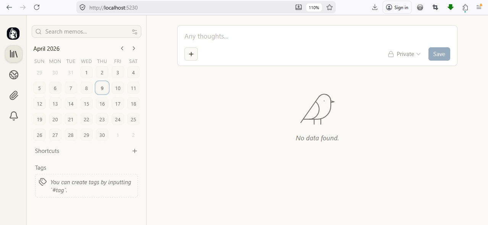

# Memos on AWS ECS Deployment

## Overview

This project demonstrates the deployment of the open-source **Memos** application to AWS using Docker, Amazon ECS/Fargate and Terraform.

The project follows the progression recommended for the ECS project:

**ClickOps → Terraform → CI/CD**

The infrastructure was initially created manually using the AWS Console to understand how the individual AWS services interact. The infrastructure was then destroyed and recreated using Terraform as Infrastructure as Code (IaC).

The final deployment uses:

- Docker for application containerisation
- Amazon ECR for container image storage
- Amazon ECS/Fargate for running the application
- Application Load Balancer (ALB) for traffic distribution
- AWS Certificate Manager (ACM) for HTTPS
- Route 53 for DNS
- Terraform for infrastructure provisioning
- Amazon S3 for Terraform remote state
- DynamoDB for Terraform state locking
- GitHub Actions for CI/CD
- GitHub Actions OIDC for AWS authentication
- Automated post-deployment health checks

### Final Application

The final application is available at:

https://tm.aftabn10.co.uk


# 1. Application Setup

## Application Selection

For this project I selected **Memos**, an open-source self-hosted note-taking application written in Go.

I chose Memos because it provided a realistic, lightweight application that could be containerised and deployed to ECS/Fargate, while allowing the main focus of the project to remain on containerisation, AWS infrastructure and deployment rather than application development.

- **Application:** Memos
- **Language:** Go
- **Application documentation:** [Memos Documentation](https://usememos.com/docs)
- **Source code:** [Memos GitHub Repository](https://github.com/usememos/memos)

## Running Memos Locally

Before introducing Docker or AWS infrastructure, I first verified that the application could run successfully on my local machine.

I navigated to the application directory:

```bash
cd ECS-Project/app/memos
```
The application was started using:
```bash
go run ./cmd/memos/main.go --port 80
```
This allowed the application to be accessed locally at:
```bash
http://localhost:80
```
## Health Endpoint

The project specification requested a /health endpoint returning a successful health response.

However, Memos uses a different health endpoint:
```bash
/healthz
```
After inspecting the application source code, I confirmed that /healthz is the endpoint exposed by the Memos server.

The endpoint was tested using:
```bash
curl http://localhost:80/healthz
```
The application returned:
```bash
Service Ready
```
This confirmed that the application was running successfully and that its health endpoint was accessible before moving on to containerisation.

# 2. Containerisation

Once the Memos application had been verified locally, the next step was to containerise the application using Docker.

The containerisation follows several best practices required by the project:

- Multi-stage Docker build
- Lightweight runtime image
- Non-root application user
- `.dockerignore` file
- Application data directory
- Local container verification

## Dockerfile

The Dockerfile is located within the Memos application directory:

```text
app/
└── memos/
    ├── Dockerfile
    ├── .dockerignore
    └── ...
```
The Dockerfile uses a multi-stage build, separating the application build environment from the final runtime environment.    

## Builder stage

The builder stage uses a Go Alpine image to compile the Memos application.

The Dockerfile first copies go.mod and go.sum and downloads the Go dependencies. Copying these files separately allows Docker to cache the dependency layer and avoid downloading the dependencies again when only application source code changes.

The remaining application source code is then copied into the builder stage and compiled into the application binary.

## Runtime stage

The runtime stage uses a lightweight Alpine image rather than the larger Go build image.

Only the compiled application binary is copied from the builder stage into the final runtime image. This reduces the size of the final image and removes unnecessary build dependencies from the runtime environment.

The runtime image also:

Creates a dedicated non-root user and group
Creates the application's data directory
Assigns ownership of the data directory to the application user
Runs the application as the non-root user
Exposes the application port
Starts the compiled Memos application

Running the application as a non-root user reduces the privileges available to the application inside the container and follows container security best practices.

## .dockerignore

A .dockerignore file is included to prevent unnecessary files from being sent to Docker as part of the build context.

This reduces the amount of data transferred during the build and prevents files that are not required by the application from being included in the build context.

## Building the Docker Image

The image was built locally using:
```bash
docker build -t memos:v1 .
```

The result image can be inspected using:
```bash
docker images
```

The final image was approximately 28 MB, demonstrating the benefit of using a multi-stage build and lightweight Alpine runtime image.

## Running the Container

During the initial containerisation testing, I experimented with different port mappings and application configurations.

The first configuration used:
```bash
docker run -d -p 80:8081 memos
```

Although the container started, accessing the application through the browser resulted in:
```text
No embeddable frontend found
```

The application's health endpoint was also tested during this process.

After reviewing the Memos documentation and testing the application using its documented Docker configuration, I found that Memos uses port 5230 for its containerised application.

The final local container was therefore run using:
```bash
docker run -d \
  -p 5230:5230 \
  -v ~/.memos:/var/opt/memos \
  memos:v1
```

The configuration:

- Maps host port `5230` to container port `5230`
- Mounts `~/.memos to /var/opt/memos`
- Provides persistent application data outside the container filesystem

The running container was verified using:
```bash
docker ps
```

## Health Check

The containerised application was then tested using its `healthz` endpoint:

```bash
curl -v http://localhost:5230/healthz
```

The application returned:
```bash
HTTP/1.1 200 OK
Content-Type: text/plain; charset=UTF-8

Service ready.
```


This confirmed that the Memos application was successfully running inside the Docker container.

The application frontend was also accessible at:
```text
http://localhost:5230
```
and the Memos interface was successfully displayed after logging in.



## Container Image

The final Docker image was approximately 28 MB.

The use of a multi-stage build means that the final runtime image contains the compiled application and the dependencies required to run it, rather than the complete Go build environment.

This provides a smaller runtime image while also reducing the attack surface of the container.

# 3. Image Registry: Amazon ECR

Once the Memos application had been successfully containerised and tested locally, the next step was to store the Docker image in a container registry.

For this project I used Amazon Elastic Container Registry (ECR), which integrates directly with Amazon ECS and allows ECS tasks to pull the container image from AWS.

## Creating the ECR Repository

The ECR repository was initially created manually through the AWS Console as part of the ClickOps stage of the project.

The repository was configured with:

Repository name: `ecr-memos-app`
Region: `eu-west-2`
Tag mutability: `Mutable`
Encryption: `AES-256`

The repository provides a location for storing the Docker images that will later be used by the ECS/Fargate service.


## Authenticating Docker with ECR

Before pushing an image, Docker needs to authenticate with the ECR registry.

The AWS CLI was used to authenticate Docker:
```bash
aws ecr get-login-password --region eu-west-2 | \
docker login --username AWS --password-stdin <account-id>.dkr.ecr.eu-west-2.amazonaws.com
```

A successful authentication returns:
```text
Login Succeeded.
```

The authentication token generated by ECR is temporary and therefore needs to be refreshed when it expires.

*Note*: Local AWS CLI authentication was used during the initial development and testing of the project. The final CI/CD pipeline does not use long-lived AWS access keys. GitHub Actions authenticates to AWS using OIDC, which is covered in Section 6 - CI/CD Automation.

## Building and Tagging the Image

The Docker image was built locally and given a version tag:
```bash
docker build -t ecr-memos-app:v1 .
```
The image then needed to be tagged with the full ECR repository URI:
```bash
docker tag ecr-memos-app:v1 \
<account-id>.dkr.ecr.eu-west-2.amazonaws.com/ecr-memos-app:v1
```
This associates the local Docker image with the remote ECR repository.

## Pushing the Image

The image was then pushed to ECR:
```bash
docker push \
<account-id>.dkr.ecr.eu-west-2.amazonaws.com/ecr-memos-app:v1
```
The image was successfully uploaded to the ECR repository.

## Verifying the Repository

The AWS CLI can be used to verify that the ECR repository exists:
```bash
aws ecr describe-repositories
```
The repository was returned with the following configuration:
```bash
Repository: ecr-memos-app
Region: eu-west-2
Tag mutability: MUTABLE
Encryption: AES256
```
The images stored in the repository can also be inspected using:
```bash
aws ecr describe-images --repository-name ecr-memos-app
```
The repository contained the pushed image with the v1 tag.

## Image Versioning

During the initial development of the project, version tags such as:
```text
v1
v2
v3
```
were used while testing changes to the Docker image.

For the final CI/CD implementation, the image is tagged using the **Git commit SHA** rather than relying on `latest`.

This provides a direct relationship between:
```text
Git commit
      ↓
Docker image
      ↓
ECR image
      ↓
ECS deployment
```
For example:
```bash
ecr-memos-app:<git-commit-sha>
```
This makes it possible to identify exactly which version of the application has been deployed.