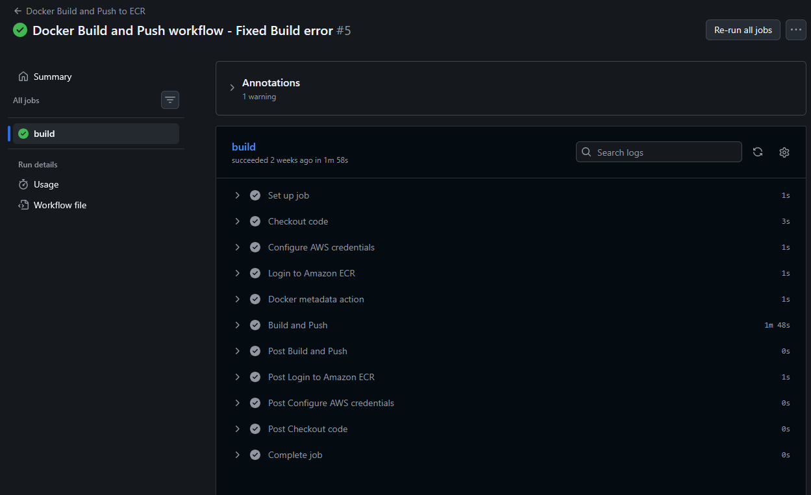
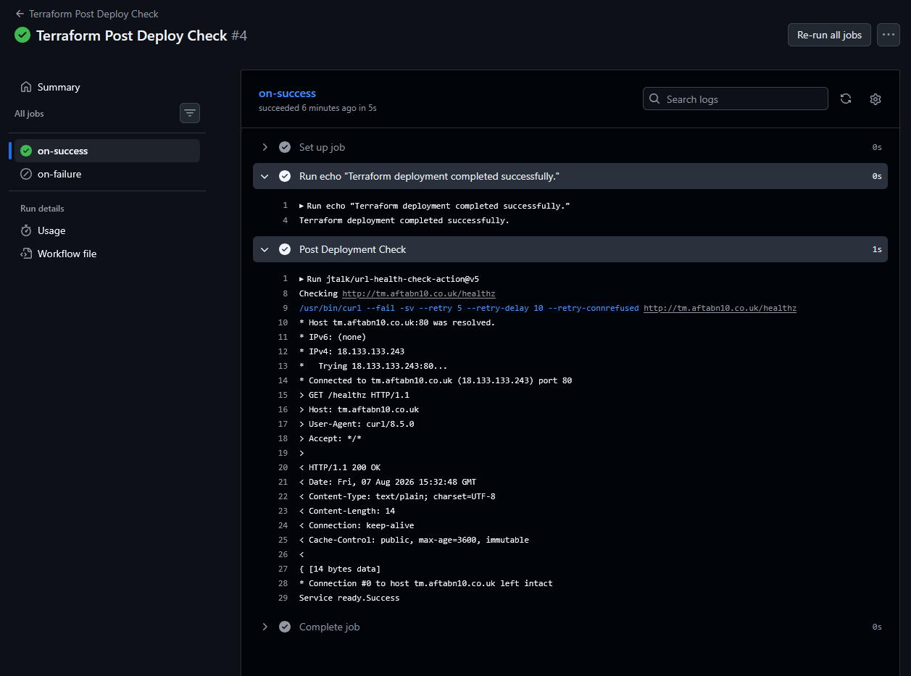
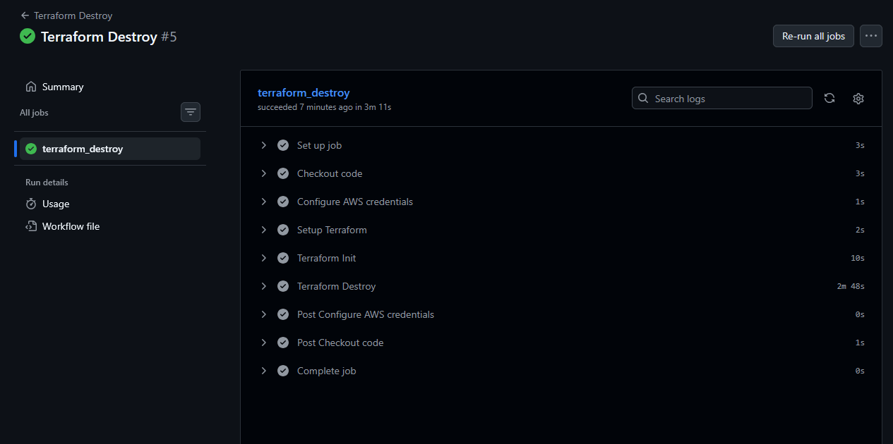

# Memos on AWS ECS Deployment

## Overview

This project demonstrates the deployment of the open-source **Memos** application to AWS using Docker, Amazon ECS/Fargate and Terraform.

The project follows the progression recommended for the ECS project:

**ClickOps → Terraform → CI/CD**

The infrastructure was initially created manually using the AWS Console to understand how the individual AWS services interact. The infrastructure was then destroyed and recreated using Terraform as Infrastructure as Code (IaC).

The final deployment uses:

- Docker for application containerisation
- Amazon ECR for container image storage
- Amazon ECS/Fargate for running the application
- Application Load Balancer (ALB) for traffic distribution
- AWS Certificate Manager (ACM) for HTTPS
- Route 53 for DNS
- Terraform for infrastructure provisioning
- Amazon S3 for Terraform remote state
- DynamoDB for Terraform state locking
- GitHub Actions for CI/CD
- GitHub Actions OIDC for AWS authentication
- Automated post-deployment health checks

### Final Application

The final application is available at:

https://tm.aftabn10.co.uk


# 1. Application Setup

## Application Selection

For this project I selected **Memos**, an open-source self-hosted note-taking application written in Go.

I chose Memos because it provided a realistic, lightweight application that could be containerised and deployed to ECS/Fargate, while allowing the main focus of the project to remain on containerisation, AWS infrastructure and deployment rather than application development.

- **Application:** Memos
- **Language:** Go
- **Application documentation:** [Memos Documentation](https://usememos.com/docs)
- **Source code:** [Memos GitHub Repository](https://github.com/usememos/memos)

## Running Memos Locally

Before introducing Docker or AWS infrastructure, I first verified that the application could run successfully on my local machine.

I navigated to the application directory:

```bash
cd ECS-Project/app/memos
```
The application was started using:
```bash
go run ./cmd/memos/main.go --port 80
```
This allowed the application to be accessed locally at:
```bash
http://localhost:80
```
## Health Endpoint

The project specification requested a /health endpoint returning a successful health response.

However, Memos uses a different health endpoint:
```bash
/healthz
```
After inspecting the application source code, I confirmed that /healthz is the endpoint exposed by the Memos server.

The endpoint was tested using:
```bash
curl http://localhost:80/healthz
```
The application returned:
```bash
Service Ready
```
This confirmed that the application was running successfully and that its health endpoint was accessible before moving on to containerisation.

# 2. Containerisation

The Memos application was containerised using Docker with a multi-stage Dockerfile.

The container was designed to meet the project requirements of:

- Multi-stage build
- Lightweight runtime image
- Non-root user
- .dockerignore
- Application data directory
- Ability to run the application locally as a container

## Dockerfile

The Dockerfile uses two stages:

```text
Builder Stage
     ↓
Compile Go application
     ↓
Runtime Stage
     ↓
Run compiled binary
```

## Builder stage

The builder stage uses a Go Alpine image to compile the Memos application.

The Dockerfile copies go.mod and go.sum separately before copying the rest of the application source code. This allows Docker to cache the dependency layer when the application source code changes but the dependencies remain the same.

The application is then compiled into a binary.

## Runtime stage

The runtime stage uses a lightweight Alpine image rather than including the complete Go build environment.

The runtime image:

- Copies the compiled application binary from the builder stage
- Creates a dedicated non-root user and group
- Creates the application's data directory
- Assigns ownership of the data directory to the application user
- Runs the application as the non-root user
- Exposes the application port

Running the application as a non-root user reduces the privileges available to the application inside the container.

## .dockerignore

A `.dockerignore` file is included to prevent unnecessary files from being sent to Docker as part of the build context.

This helps reduce the build context and prevents files that are not required by the application from being included during the image build.

## Building the Image

The Docker image can be built from the Memos application directory using:
```bash
docker build -t memos .
```

The resulting image was checked using:
```bash
docker images
```

The final image was approximately 28 MB, providing a relatively small runtime footprint.

## Running Memos as a Container

Memos requires a data directory for its application data. The container therefore mounts a local directory to the application's data directory.

The application is run using port 5230:
```bash
docker run -d \
  -p 5230:5230 \
  -v ~/.memos:/var/opt/memos \
  memos
```
The application can then be accessed locally at:
```bash
http://localhost:5230
```
The container can be checked using:
```bash
docker ps
```

## Container Health Check

The Memos health endpoint was verified from the running container:

```bash
curl -v http://localhost:5230/healthz
```

The endpoint returned a successful response:
```bash
Service Ready.
```


This confirmed that the Memos application was running successfully inside the Docker container.


## Container Security

The final Docker image does not run the Memos application as the root user.

A dedicated application user is created during the runtime stage and the application is executed using that user.

This follows the principle of running containers with the minimum privileges required.

# 3. Image Registry: Amazon ECR

Once the Docker image had been successfully tested locally, it was pushed to **Amazon Elastic Container Registry (ECR)**.

ECR was selected because it integrates directly with Amazon ECS/Fargate and provides a private registry for storing the container image used by the ECS task.

## ECR Repository

An ECR repository was created for the Memos application:
```text
ecr-memos-app
```
The repository uses:

- Mutable image tags
- AES-256 encryption

The repository URI follows the standard AWS ECR format:
```text
<account-id>.dkr.ecr.<region>.amazonaws.com/ecr-memos-app
```


## Authenticating Docker with ECR

Docker was authenticated against the ECR registry using the AWS CLI.

The authentication process generates a temporary authentication token and uses it to log Docker into the ECR registry.

For example:
```bash
aws ecr get-login-password --region eu-west-2 | \
docker login --username AWS --password-stdin <account-id>.dkr.ecr.eu-west-2.amazonaws.com
```

A successful authentication returns:
```text
Login Succeeded.
```
## Tagging the Image

The Docker image was tagged using a version identifier before being pushed to ECR.

For example:
```bash
docker build -t ecr-memos-app:v1 .
```
The image was then tagged with the ECR repository URI:
```bash
docker tag ecr-memos-app:v1 \
  <account-id>.dkr.ecr.eu-west-2.amazonaws.com/ecr-memos-app:v1
```
## Pushing the Image

The tagged image was pushed to ECR:
```bash
docker push \
  <account-id>.dkr.ecr.eu-west-2.amazonaws.com/ecr-memos-app:v1
```
The image can then be verified using:
```bash
aws ecr describe-images \
  --repository-name ecr-memos-app
```
The repository successfully contained the pushed image and its associated image digest.

## Image Versioning

During the initial manual testing, version tags such as v1, v2 and v3 were used while making changes to the Docker image.

For the final automated deployment process, the image is tagged using the Git commit SHA.

This provides an immutable reference between a GitHub commit and the Docker image deployed to ECS.

The final deployment flow is therefore:
```text
GitHub Commit
      ↓
GitHub Actions
      ↓
Docker Build
      ↓
Image tagged with Git SHA
      ↓
Amazon ECR
      ↓
Amazon ECS/Fargate
```

# 4. AWS Infrastructure - ClickOps

Before introducing Terraform, the AWS infrastructure was created manually using the AWS Management Console.

The purpose of this stage was to understand how the individual AWS services interact and how traffic flows through the application before converting the infrastructure into Infrastructure as Code.

The process followed:
```text
User
  ↓
Route 53
  ↓
Application Load Balancer
  ↓
ECS/Fargate
  ↓
Memos Container
```

## AWS Services Created

The initial infrastructure consisted of:

- Amazon VPC
- Public subnets
- Internet Gateway
- Security groups
- Amazon ECR
- Amazon ECS cluster
- ECS/Fargate task definition
- ECS service
- Application Load Balancer
- ALB target group
- ALB listeners
- AWS Certificate Manager certificate
- Route 53 DNS record
- IAM roles required by ECS
- ECR

The Memos Docker image previously pushed to Amazon ECR was used as the container image for the ECS task.

The ECS task definition referenced the image stored in the ECR repository.

## ECS/Fargate

An ECS cluster was created using AWS Fargate as the compute platform.

Fargate was used so that the application could run as a container without having to provision or manage EC2 instances.

The ECS service was configured to maintain the desired number of running tasks.

## Application Load Balancer

An Application Load Balancer was placed in front of the ECS service.

The ALB provides the entry point for external traffic and forwards requests to the ECS task through a target group.

The target group was configured to perform health checks against the application.

## Networking

The ECS service and Application Load Balancer were deployed within the VPC.

Security groups were used to control network access between the internet, load balancer and ECS service.

The overall traffic flow was:
```text
Internet
   ↓
ALB
   ↓
ECS Service
   ↓
Fargate Task
   ↓
Memos Container
```
## HTTPS and DNS

AWS Certificate Manager was used to provide the TLS certificate for the application domain.

A Route 53 record was then configured to point the application domain to the Application Load Balancer.

The application was made available through:
```text
https://tm.aftabn10.co.uk
```
## ClickOps Verification

Once all components had been configured, the application was accessed through the public domain to verify that the complete AWS infrastructure was working.

The ClickOps deployment successfully demonstrated that:

- The Docker image could run on ECS/Fargate
- The ALB could route traffic to the ECS task
- The application was reachable through the public domain
- HTTPS was working
- Route 53 was resolving the domain correctly

## Why Destroy the ClickOps Infrastructure?

Once the manual deployment had been successfully verified, the infrastructure was deliberately torn down.

This was an important part of the project because the next stage was to recreate the same environment using Terraform.

The progression was therefore:
```text
Manual AWS Infrastructure
          ↓
       Verify
          ↓
       Destroy
          ↓
Recreate using Terraform
```
This provided a direct comparison between manually created infrastructure and Infrastructure as Code.

# 5. AWS Infrastructure - Terraform

After completing the ClickOps deployment, the AWS infrastructure was recreated using Terraform.

The objective was to reproduce the same environment in a repeatable and version-controlled way rather than relying on manually configured AWS resources.

The Terraform configuration is contained within the infra/ directory.

## Terraform Structure

The infrastructure was separated into Terraform modules rather than being maintained as a single large configuration.

The structure is broadly:
```text
infra/
├── main.tf
├── provider.tf
├── variables.tf
├── outputs.tf
└── modules/
    ├── vpc/
    ├── ecs/
    ├── alb/
    ├── ecr/
    └── acm/
```
This separates the main infrastructure configuration from individual AWS components and makes the configuration easier to maintain.

## Terraform Provider

Terraform uses the AWS provider to provision resources within the AWS environment.

The deployment region used for the project is:
```text
eu-west-2
```
## VPC and Networking

Terraform provisions the networking required by the application, including:

- VPC
- Public subnets
- Internet Gateway
- Route tables
- Subnet associations

The networking configuration provides the connectivity required by the ALB and ECS/Fargate service.

## Amazon ECR

The ECR repository is managed through Terraform so that the container registry becomes part of the infrastructure definition.

The ECS task can then reference the image stored in this repository.

## ECS and Fargate

Terraform provisions:

- ECS cluster
- ECS task definition
- ECS service
- Fargate configuration

The task definition specifies the Memos container, including its image, port configuration and required IAM permissions.

The ECS service maintains the desired number of running tasks.

## Application Load Balancer

Terraform provisions the ALB infrastructure, including:

- Application Load Balancer
- Target group
- Listeners
- Listener configuration
- Security groups

The target group allows the ALB to determine whether the ECS task is healthy before sending traffic to it.

## IAM

IAM roles are provisioned for the ECS workload.

These roles provide the permissions required by the ECS task without relying on long-lived credentials embedded within the application or container.

The infrastructure follows the principle of granting workloads only the permissions required for their operation.

## HTTPS and Route 53

Terraform also manages the application's HTTPS and DNS configuration.

This includes:

- ACM certificate
- Certificate validation
- Route 53 record
- ALB listener configuration

The final application is available through:
```text
https://tm.aftabn10.co.uk
```

## Terraform Remote State

Terraform state is stored remotely rather than being maintained only on the local machine.

The project uses:

- Amazon S3 for Terraform remote state
- DynamoDB for Terraform state locking

This allows the Terraform state to persist independently of the machine running Terraform and prevents multiple Terraform operations from modifying the state simultaneously.

The remote state was particularly important when moving the Terraform deployment into GitHub Actions.

The GitHub Actions runner can run:
```bash
terraform init
```
and retrieve the existing remote state before performing:
```bash
terraform plan
terraform apply
terraform destroy
```

This means the CI/CD runner does not need to have previously created the infrastructure itself in order to understand the existing Terraform-managed resources.

## Terraform Validation

Before applying the infrastructure, the configuration is checked using:
```bash
terraform fmt -check -recursive
```
and
```bash
terraform validate
```
Terraform then generates an execution plan:
```bash
terraform plan
```
The infrastructure can subsequently be deployed using:
```bash
terraform apply
```
## Terraform Destroy

The infrastructure can also be removed using:
```bash
terraform destroy
```
A dedicated GitHub Actions workflow was later created to perform Terraform destruction manually with an additional confirmation input.

This provides a controlled way of removing the infrastructure while still allowing Terraform to use the existing remote state.

# 6. CI/CD Automation

Once the infrastructure could be successfully recreated using Terraform, the deployment process was automated using GitHub Actions.

The CI/CD implementation was separated into individual workflows so that application builds, infrastructure deployment and post-deployment verification could be managed independently.

The final workflow structure is:
```text
.github/
└── workflows/
    ├── docker-build-push.yml
    ├── terraform-deploy.yml
    ├── terraform-destroy.yml
    └── terraform-post-deploy-check.yml
```

## Build and Push

The Docker Build and Push workflow is responsible for building the Memos Docker image and pushing it to Amazon ECR.

The workflow is triggered when changes are pushed to the application or the workflow itself, and can also be started manually using workflow_dispatch.

The main stages are:

1. Checkout the repository
2. Configure AWS credentials
3. Authenticate with Amazon ECR
4. Generate Docker image metadata
5. Build the Docker image
6. Push the image to ECR

The image is tagged using the Git commit SHA rather than using latest.

## Successful Build & Push

The workflow successfully completed the Docker build and push process:


erraform Deploy

The Terraform Deploy workflow is responsible for provisioning and updating the AWS infrastructure.

The workflow is triggered when changes are pushed to the Terraform infrastructure or workflow files, and also supports manual execution using workflow_dispatch.

The workflow performs the following steps:

1. Checkout the repository
2. Configure AWS credentials using GitHub Actions OIDC
3. Set up Terraform
4. Run terraform fmt -check -recursive
5. Run terraform init
6. Run terraform validate
7. Run terraform plan
8. Run terraform apply

Terraform is therefore responsible for recreating and updating the AWS infrastructure rather than requiring the AWS Console for deployment.

The workflow uses OIDC to authenticate GitHub Actions with AWS, avoiding the need to store long-lived AWS access keys in GitHub.

## Successful Terraform Deployment

The Terraform deployment completed successfully:


## Post-Deployment Check

A separate Post Deploy Check workflow was created to verify that the application was actually available after Terraform had completed.

Rather than assuming that a successful Terraform deployment means the application is healthy, the workflow performs an HTTP health check against the deployed application.

The workflow uses GitHub Actions' workflow_run trigger to run after the Terraform Deploy workflow completes. It only performs the health check when the Terraform deployment itself has completed successfully.

The health check calls:
```bash
http://tm.aftabn10.co.uk/healthz
```
The workflow retries the request up to five times with a ten-second delay between attempts.

A successful response from the deployed application confirms that the infrastructure deployment has resulted in a reachable application.

If the health check receives an unsuccessful HTTP response, the health-check action fails and the post-deployment workflow is marked as unsuccessful.

## Successful Post-Deployment Check

The final post-deployment check completed successfully:


# Terraform Destory

A separate Terraform Destroy workflow was also created for tearing down the AWS infrastructure when the environment is no longer required.

This was particularly useful during development because the project followed the intended approach:
```text
ClickOps
   ↓
Destroy
   ↓
Terraform / IaC
   ↓
Automated deployment
```

The destroy workflow successfully removed the Terraform-managed infrastructure:


The destroy workflow is not part of the application deployment path, but provides a controlled way of removing the infrastructure created by Terraform.

# 7. HTTPS and Domain Validation

The final deployment is exposed using a custom domain with HTTPS.

The following AWS services were used to provide secure access to the application:

- Amazon Route 53 for DNS
- AWS Certificate Manager (ACM) for the TLS certificate
- Application Load Balancer (ALB) for HTTPS traffic

## Custom Domain

A Route 53 record was configured for:

```text
tm.aftabn10.co.uk
```

The record points to the Application Load Balancer using an alias record.

This allows requests to the application to use the custom domain rather than the default AWS load balancer DNS name.

## TLS Certificate

An SSL/TLS certificate was provisioned using AWS Certificate Manager (ACM) for the application domain.

DNS validation was used to validate ownership of the domain before the certificate was issued.

The certificate was then associated with the ALB HTTPS listener on port 443.

## HTTPS Traffic Flow

The final request flow is:
```text
User
  ↓
https://tm.aftabn10.co.uk
  ↓
Route 53
  ↓
Application Load Balancer
  ↓
HTTPS / TLS termination
  ↓
ECS / Fargate
  ↓
Memos application
```
TLS is terminated at the Application Load Balancer. The ALB then forwards the request to the ECS task using HTTP on the container port.

## Domain Verification

The final application was accessed using:
```text
https://tm.aftabn10.co.uk
```
The Memos application was successfully served through the custom domain using HTTPS.

The application's health endpoint can also be tested using
```text
curl -v https://tm.aftabn10.co.uk/healthz
```
The endpoint returned a successful HTTP response:
```text
HTTP/1.1 200 OK
```
with the Memos health response:
```text
Service ready.
```
This confirmed that:

- The custom domain resolves successfully
- Route 53 is pointing to the ALB
- The ACM certificate is being used for HTTPS
- The ALB can successfully forward traffic to the ECS service
- The Memos application is responding successfully